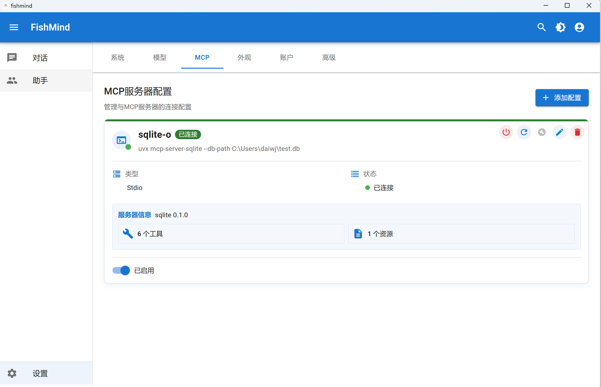

# FishMind


FishMind 是一个支持多种人工智能语言模型(LLM)的跨平台桌面客户端，为用户提供丰富的 AI 交互体验。

[](https://www.gnu.org/licenses/gpl-3.0)


## 项目特点

- 支持多种人工智能模型的统一对话界面
- MCP 服务支持
- 可自定义创建和管理 AI 助手
- 跨平台支持 Windows、macOS 和 Linux 系统
- 丰富的设置选项，满足个性化需求
- 深色/浅色主题切换

## 技术栈

- **桌面应用框架**：Tauri 2.x
- **前端框架**：React 18.x
- **UI 组件库**：Material UI (MUI) 6.x
- **语言**：TypeScript, Rust (Tauri 后端)
- **构建工具**：Vite
- **包管理工具**：pnpm

## 安装与运行

### 前置条件

- [Node.js](https://nodejs.org/) (推荐 v18+)
- [Rust](https://www.rust-lang.org/tools/install)
- [pnpm](https://pnpm.io/installation)
- 安装 [Tauri 前置依赖](https://tauri.app/v1/guides/getting-started/prerequisites)

### 开发环境

```bash
# 克隆仓库
git clone https://github.com/fishcode2025/fishmind.git

# 进入项目目录
cd fishmind

# 安装依赖
pnpm install

# 启动开发服务
pnpm tauri dev
```

### 构建应用

```bash
# 构建生产版本
pnpm tauri build
```

## 项目结构

```
fishmind/
├── src/                      # React前端代码
│   ├── assets/               # 静态资源(图片、图标等)
│   ├── components/           # 可复用组件
│   ├── pages/                # 应用页面
│   ├── contexts/             # React上下文
│   ├── hooks/                # 自定义钩子
│   ├── services/             # API服务和后端通信
│   ├── utils/                # 工具函数
│   ├── types/                # TypeScript类型定义
│   ├── theme/                # MUI主题配置
│   └── ...
├── src-tauri/                # Tauri后端代码
│   ├── src/                  # Rust代码
│   └── tauri.conf.json       # Tauri配置
├── public/                   # 公共资源
├── docs/                     # 项目文档
└── ...
```

## 主要功能

### 1. 主对话界面
- 多模型支持的对话界面
- Markdown 渲染和代码高亮
- 对话历史记录管理

### 2. 助手管理系统
- 创建和自定义 AI 助手
- 管理助手预设和配置
- 助手分类与组织

### 3. 设置系统
- 应用外观与行为配置
- API 密钥与模型设置
- 数据管理与备份

## 贡献指南

我们欢迎各种形式的贡献，包括功能请求、错误报告和代码贡献。

1. Fork 本仓库
2. 创建您的特性分支 (`git checkout -b feature/amazing-feature`)
3. 提交您的更改 (`git commit -m 'Add some amazing feature'`)
4. 推送到分支 (`git push origin feature/amazing-feature`)
5. 打开一个 Pull Request

## 插件使用

FishMind 使用多种 Tauri 插件增强功能：

- [文件系统插件](https://v2.tauri.app/plugin/file-system/) - 访问本地文件系统
- [SQL 插件](https://v2.tauri.app/plugin/sql/) - 本地数据存储
- [Shell 插件](https://v2.tauri.app/plugin/shell/) - 执行系统命令

## 路线图

- [ ] 插件系统支持
- [ ] 本地模型集成
- [ ] 更多格式的文件处理
- [ ] 团队协作功能
- [ ] 高级数据分析功能

## 许可证

本项目采用 [GNU 通用公共许可证 v3.0](https://www.gnu.org/licenses/gpl-3.0) 许可 - 详情请参阅 [LICENSE](LICENSE) 文件。

## 联系方式

- GitHub: [fishcode2025](https://github.com/fishcode2025)
- 项目地址: [https://github.com/fishcode2025/fishmind](https://github.com/fishcode2025/fishmind)

---

*FishMind - 释放 AI 的无限潜能*
