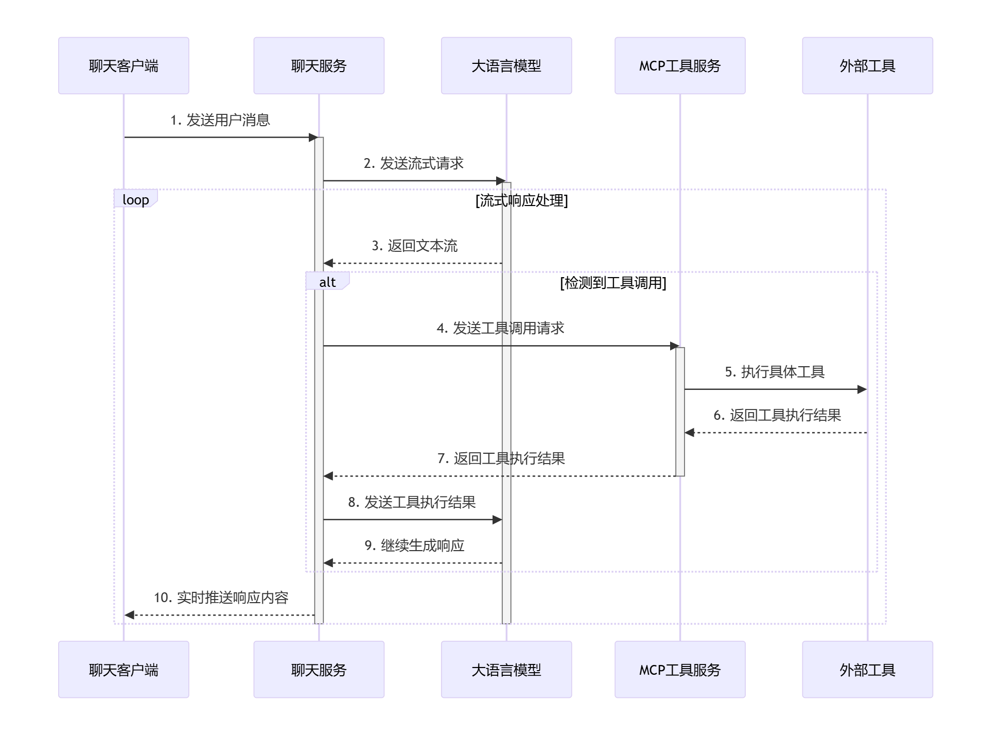

    ```mermaid
    sequenceDiagram
    participant Client as 聊天客户端
    participant Chat as 聊天服务
    participant LLM as 大语言模型
    participant MCP as MCP工具服务
    participant Tool as 外部工具

    Client->>Chat: 1. 发送用户消息
    activate Chat
    
    Chat->>LLM: 2. 发送流式请求
    activate LLM
    
    loop 流式响应处理
        LLM-->>Chat: 3. 返回文本流
        
        alt 检测到工具调用
            Chat->>MCP: 4. 发送工具调用请求
            activate MCP
            
            MCP->>Tool: 5. 执行具体工具
            Tool-->>MCP: 6. 返回工具执行结果
            
            MCP-->>Chat: 7. 返回工具执行结果
            deactivate MCP
            
            Chat->>LLM: 8. 发送工具执行结果
            LLM-->>Chat: 9. 继续生成响应
        end
        
        Chat-->>Client: 10. 实时推送响应内容
    end
    
    deactivate LLM
    deactivate Chat
    ```


               