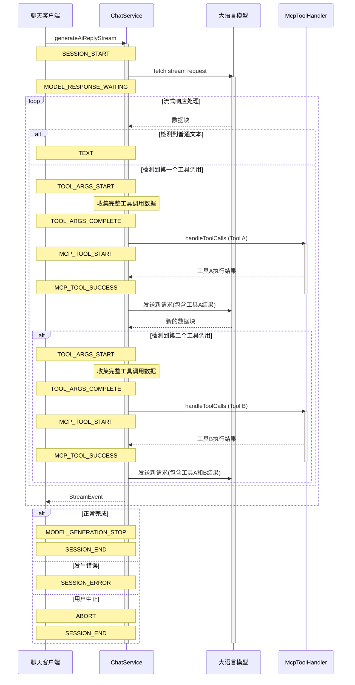

```mermaid
sequenceDiagram
    participant Client as 聊天客户端
    participant Chat as ChatService
    participant LLM as 大语言模型
    participant MCP as McpToolHandler
    
    Client->>Chat: generateAiReplyStream
    activate Chat
    Note over Chat,Client: SESSION_START
    
    Chat->>LLM: fetch stream request
    activate LLM
    Note over Chat,Client: MODEL_RESPONSE_WAITING
    
    loop 流式响应处理
        LLM-->>Chat: 数据块
        
        alt 检测到普通文本
            Note over Chat,Client: TEXT
        else 检测到第一个工具调用
            Note over Chat,Client: TOOL_ARGS_START
            Note over Chat: 收集完整工具调用数据
            Note over Chat,Client: TOOL_ARGS_COMPLETE
            
            Chat->>MCP: handleToolCalls (Tool A)
            activate MCP
            Note over Chat,Client: MCP_TOOL_START
            MCP-->>Chat: 工具A执行结果
            Note over Chat,Client: MCP_TOOL_SUCCESS
            deactivate MCP
            
            Chat->>LLM: 发送新请求(包含工具A结果)
            
            LLM-->>Chat: 新的数据块
            
            alt 检测到第二个工具调用
                Note over Chat,Client: TOOL_ARGS_START
                Note over Chat: 收集完整工具调用数据
                Note over Chat,Client: TOOL_ARGS_COMPLETE
                
                Chat->>MCP: handleToolCalls (Tool B)
                activate MCP
                Note over Chat,Client: MCP_TOOL_START
                MCP-->>Chat: 工具B执行结果
                Note over Chat,Client: MCP_TOOL_SUCCESS
                deactivate MCP
                
                Chat->>LLM: 发送新请求(包含工具A和B结果)
            end
        end
        
        Chat-->>Client: StreamEvent
    end
    
    
    alt 正常完成
        Note over Chat,Client: MODEL_GENERATION_STOP
        Note over Chat,Client: SESSION_END
    else 发生错误
        Note over Chat,Client: SESSION_ERROR
    else 用户中止
        Note over Chat,Client: ABORT
        Note over Chat,Client: SESSION_END
    end
    
    deactivate LLM
    deactivate Chat
```