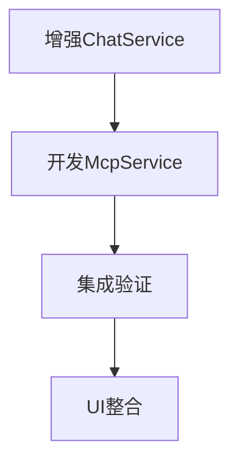

# 第一阶段详细开发计划



## 阶段1：增强ChatService功能（2周）

### 1.1 添加函数调用支持
```typescript:src/services/chat/ChatService.ts
// 在generateAiReply方法中增加函数调用处理
interface FunctionCall {
  name: string;
  arguments: Record<string, any>;
}

async generateAiReply(topicId: string, modelId?: string, providerId?: string): Promise<Message> {
  // ...现有代码...

  // 修改请求体包含工具列表
  const requestBody = {
    ...existingBody,
    tools: [{
      type: 'function',
      function: {
        name: 'execute_mcp_tool',
        description: 'Execute MCP tool operation',
        parameters: {
          type: 'object',
          properties: {
            toolName: { type: 'string' },
            params: { type: 'object' }
          }
        }
      }
    }]
  };

  // 处理函数调用响应
  if (data.choices[0].finish_reason === 'function_call') {
    const functionCall = data.choices[0].message.function_call;
    return this.handleFunctionCall(topicId, functionCall);
  }
}

private async handleFunctionCall(topicId: string, call: FunctionCall) {
  // 验证并执行函数调用
  if (call.name === 'execute_mcp_tool') {
    return this.executeMcpTool(topicId, call.arguments);
  }
  // ...其他函数处理...
}
```

### 1.2 验证方法
```typescript
// __tests__/chatService.test.ts
test('应正确处理函数调用响应', async () => {
  mockAIResponse({
    choices: [{
      message: {
        function_call: {
          name: 'execute_mcp_tool',
          arguments: JSON.stringify({ toolName: 'weather', params: { city: '北京' } })
        }
      }
    }]
  });

  const result = await chatService.generateAiReply('topic1');
  expect(result.content).toContain('天气查询结果');
});
```

## 阶段2：开发McpIntegrationService（3周）

### 2.1 服务接口设计
```typescript:src/services/mcp/McpIntegrationService.ts
interface IMcpIntegrationService {
  executeTool(request: {
    clientId: string;
    toolName: string;
    params: Record<string, any>;
  }): Promise<{
    success: boolean;
    result: any;
    error?: string;
  }>;

  verifyToolPermission(
    userId: string,
    toolName: string
  ): Promise<{ allowed: boolean; reason?: string }>;
}
```

### 2.2 核心实现
```typescript
class McpIntegrationService implements IMcpIntegrationService {
  async executeTool(request) {
    // 调用Tauri后端
    try {
      const result = await invoke('call_mcp_tool', request);
      return { success: true, result };
    } catch (error) {
      return { 
        success: false,
        error: error instanceof Error ? error.message : 'Unknown error'
      };
    }
  }
}
```

### 2.3 验证方法
```typescript
// __tests__/mcpService.integration.spec.ts
describe('McpIntegrationService', () => {
  it('应成功执行工具调用', async () => {
    const result = await service.executeTool({
      clientId: 'client1',
      toolName: 'file_search',
      params: { pattern: '*.md' }
    });
    
    expect(result.success).toBe(true);
    expect(result.result).toHaveProperty('files');
  });
});
```

## 阶段3：功能集成（2周）

### 3.1 聊天页面集成
```typescript:src/pages/Chat.tsx
const handleSendMessage = async (content: string) => {
  // 检测MCP指令
  if (content.startsWith('/mcp ')) {
    const [command, ...args] = content.slice(5).split(' ');
    return executeMcpCommand(command, args);
  }
  
  // 原有消息处理逻辑...
};

const executeMcpCommand = async (command: string, args: string[]) => {
  // 1. 解析参数
  // 2. 调用McpIntegrationService
  // 3. 处理结果并更新消息列表
};
```

### 3.2 验证方法
```gherkin
# acceptance/mcp_command.feature
Feature: MCP命令执行
  Scenario: 执行文件搜索
    Given 当前已连接MCP服务
    When 用户发送"/mcp file_search *.md"
    Then 应显示包含".md"文件的搜索结果
    And 审计日志中应有对应记录
```

## 阶段4：端到端测试（1周）

### 测试矩阵
| 测试场景 | 验证点 | 通过标准 |
|----------|--------|----------|
| 简单工具调用 | 结果正确性 | 返回数据结构匹配预期 |
| 复杂参数传递 | 参数解析 | 嵌套参数正确传递 |
| 错误处理 | 异常反馈 | 显示友好错误信息 |
| 权限验证 | 安全控制 | 未授权操作被拒绝 |

```typescript
// cypress/e2e/mcp.cy.ts
describe('MCP功能集成测试', () => {
  it('应成功执行工具调用并显示结果', () => {
    cy.get('#messageInput').type('/mcp weather 北京{enter}');
    cy.get('.message-result').should('contain', '北京天气');
  });
});
```

## 里程碑计划

```gantt
gantt
  title 第一阶段开发甘特图
  dateFormat  YYYY-MM-DD
  section ChatService
  函数调用支持       :active, a1, 2024-03-01, 7d
  参数验证增强       :         a2, after a1, 5d
  section McpService
  核心接口开发       :         b1, 2024-03-05, 10d
  权限系统集成       :         b2, after b1, 5d
  section 集成
  UI适配层开发      :         c1, 2024-03-15, 7d
  端到端测试        :         c2, after c1, 5d
```

## 风险控制

| 风险点 | 缓解措施 | 应急方案 |
|--------|----------|----------|
| 大模型响应格式不稳定 | 严格schema校验 | 添加fallback解析器 |
| MCP服务连接超时 | 实现重试机制 | 提供离线缓存功能 |
| 权限验证延迟 | 本地策略缓存 | 二次确认对话框 |
