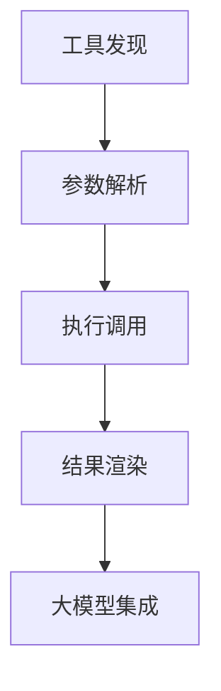

# MCP 扩展功能开发计划

## 需求复述
- 分三阶段实现MCP扩展功能
- 第一阶段：基础工具调用与大模型交互
- 第二阶段：扩展资源管理能力
- 第三阶段：增强安全与审计功能
- 每个阶段分解为可验证的开发单元
- 每个单元需明确验证方式（单元测试/人工确认）

## 第一阶段：基础工具调用（预计周期：6周）

### 阶段目标


### 开发单元

| 单元编号 | 功能描述                  | 验证方式                          | 预计周期 |
|----------|-------------------------|-----------------------------------|----------|
| FE-001   | 工具面板UI组件开发        | 人工验证组件交互                  | 1周      |
| BE-001   | 工具发现接口增强          | 单元测试覆盖率≥80%               | 2周      |
| FE-002   | 动态参数表单生成器        | Jest测试表单渲染逻辑              | 2周      |
| BE-002   | 工具调用执行引擎          | 集成测试验证SSE/Stdio协议         | 3周      |
| AI-001   | 大模型指令解析适配器      | 人工测试10个样本指令              | 2周      |

```typescript
// 示例验证用例（BE-002）
test('工具调用应返回结构化结果', async () => {
  const result = await invokeTool('weather', { city: '北京' });
  expect(result).toHaveProperty('temperature');
  expect(result).toHaveProperty('humidity');
});
```

## 第二阶段：资源管理扩展（预计周期：8周）

### 阶段目标


### 开发单元

| 单元编号 | 功能描述                  | 验证方式                          | 预计周期 |
|----------|-------------------------|-----------------------------------|----------|
| FE-003   | 资源树形导航组件          | Cypress端到端测试                | 2周      |
| BE-003   | 资源元数据接口            | 单元测试+Postman验证             | 2周      |
| FE-004   | 文件预览浮动窗            | 人工验证5种文件类型渲染           | 3周      |
| BE-004   | 资源变更订阅机制          | 集成测试消息推送延迟＜500ms       | 3周      |
| AI-002   | 上下文感知推荐引擎        | A/B测试点击率提升验证             | 2周      |

## 第三阶段：安全增强（预计周期：6周）

### 阶段目标


### 开发单元

| 单元编号 | 功能描述                  | 验证方式                          | 预计周期 |
|----------|-------------------------|-----------------------------------|----------|
| FE-005   | 审批流程UI工作流          | 人工模拟10种审批场景              | 2周      |
| BE-005   | 审计日志存储引擎          | 压力测试支持1000TPS               | 3周      |
| BE-006   | RBAC权限控制系统          | 单元测试覆盖率100%                | 3周      |
| SEC-001  | 传输层加密增强            | 使用Wireshark验证加密有效性        | 2周      |

## 验收标准
```gantt
gantt
  title MCP扩展功能里程碑
  dateFormat  YYYY-MM-DD
  section 第一阶段
  工具面板       :done,    des1, 2024-03-01, 7d
  调用引擎       :active,  des2, 2024-03-08, 14d
  section 第二阶段
  资源导航       :         des3, 2024-04-01, 14d
  预览系统       :         des4, 2024-04-15, 14d
  section 第三阶段
  安全审计       :         des5, 2024-05-01, 21d
```
