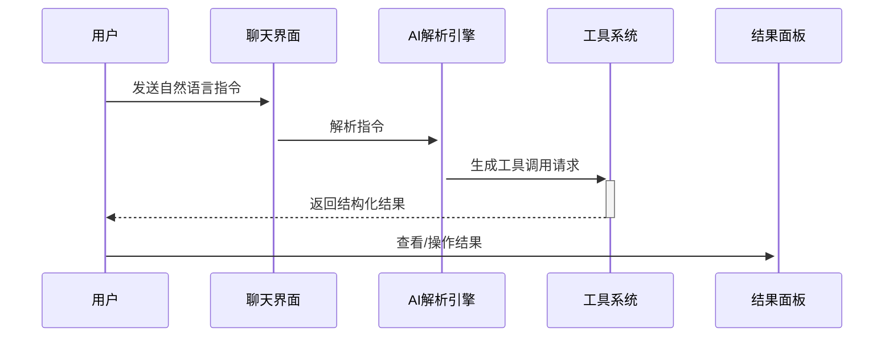

# MCP 协议集成需求分析文档

## 一、核心功能模块

### 1. 连接管理
- **功能编号**: MCP-CONN-001
- **功能描述**:
  - 支持 SSE/Stdio 双协议连接
  - 连接状态实时监控与可视化
  - 自动重连与故障转移机制
- **技术实现**:
  ```mermaid
  graph LR
    A[前端] -->|HTTP| B[SSE连接]
    A -->|子进程| C[Stdio连接]
    B --> D[Rust后端]
    C --> D
    D --> E[状态管理]
  ```

### 2. 工具系统
- **功能编号**: MCP-TOOL-002
- **功能矩阵**:

| 子功能           | 前端组件               | 后端接口                     | 进度 |
|------------------|-----------------------|----------------------------|------|
| 工具发现         | 工具面板              | GET /tools                 | 60%  |
| 参数表单生成     | 动态表单生成器        | POST /tools/{name}/schema  | 30%  |
| 流式结果展示     | 终端模拟器组件        | WS /tools/{id}/stream      | 10%  |

### 3. 资源系统
- **功能示例**:
```typescript
interface McpResource {
  uri: string;        // 资源标识符
  mimeType: string;   // MIME类型
  preview?: string;   // 预览内容
  metadata: {         // 扩展元数据
    size?: number;
    modified?: string;
  };
}
```

## 二、扩展功能模块

### 4. 智能集成
- **流程图**:


### 5. 安全审计
- **审计日志结构**:
```rust
pub struct AuditLog {
  pub timestamp: DateTime<Utc>,
  pub operation: String,
  pub user: String,
  pub client_id: String,
  pub status: OperationStatus,
  pub params: serde_json::Value,
}
```

## 三、接口规范

### 工具调用协议
```typescript
interface ToolExecuteRequest {
  clientId: string;
  toolName: string;
  params: Record<string, JsonValue>;
  context?: {
    chatSessionId?: string;
    currentResource?: string;
  };
}

interface ToolStreamEvent {
  type: 'data' | 'error' | 'complete';
  payload: JsonValue;
  metadata?: {
    sequence: number;
    timestamp: string;
  };
}
```

## 四、实施路线图

| 阶段   | 目标                          | 里程碑                      | 预计完成 |
|--------|------------------------------|----------------------------|----------|
| 第一阶段 | 基础连接与工具调用           | 实现SSE协议工具调用流程     | Q3 2024  |
| 第二阶段 | 资源系统与智能集成           | 完成资源预览与AI自动调用    | Q4 2024  |
| 第三阶段 | 安全审计与生产环境部署       | 通过安全审计验收            | Q1 2025  |
